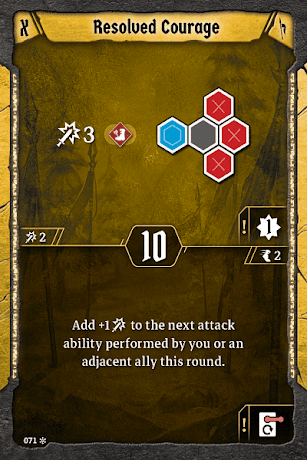

# Example Level One Hand

Banner

Attacks

Movement

Utility

We need three more cards to round out our build. Two cards certainly don’t give us enough movement, so we’ll pick up [TIp of the Spear](#_9biaxul0blo7). We might be able to use the top attack as well, since it’s a relatively safe formation that we can activate without putting our banner in any danger at all. It’s also our only decently late initiative, since we aren’t at all interested in [Unbreakble Wall](#_u2k00e745ao6). We don’t really care about late initiatives since we don’t plan to be in the frontlines much, but it may occasionally matter for our summons. 

This is also our best chance to enable [Incendiary Throw](#_8o6bxqg6p44y). We’ll grab both that and [Resolved Courage](#_zgu5oklkgem7) to all but guarantee that the wound goes off at a fast initiative. If we do ever make our way into the frontline, we’ll be able to use [Resolved Courage](#_zgu5oklkgem7)’s top attack, but it isn’t our focus. However, if your team has a bit more space in the frontline, or is a bit weak on the tanking front, consider bringing [Deflecting Maneuver](#_hu136o2o5ou) in place of either of these cards. We’ll have the wind to spare for a while, and to be honest we can use the XP, with [At All Costs](#_b47um9ulhbgb) being our only nonloss source until level two. 

We’ve mostly left home risky melee attacks and formations that we just won’t be able to justify moving to pull off. However, consider bringing [Pincer Movement](#_768ksnsz0b8i) for the bottom loot if a scenario looks like it’s very easy and/or requires very little movement. You can drop [Tip of the Spear](#_9biaxul0blo7) if this is the case. We should have time to grab the loot our team leaves behind for us, but we’re never going to say no to more looting potential.
