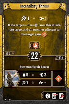

# Level 3 Hand

Banner

Attacks

Movement

Utility

Head of the Hammer is a clean upgrade to [Tip of the Spear](#_9biaxul0blo7): the same movement at a slower initiative while also providing our desired element. We probably won’t much care about the muddle, but that’s perfectly fine; the card still does plenty if the muddle never happens. We’re up to two wind sources, so if you’ve found yourself occasionally in melee range, consider [Deflecting Maneuver](#_hu136o2o5ou) over [Incendiary Throw](#_8o6bxqg6p44y). 

[Level 4 Level\-up Choice](#_73xk82jjscx8)
