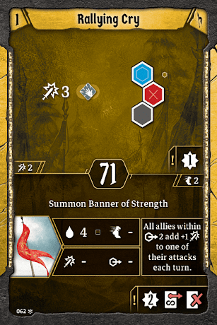
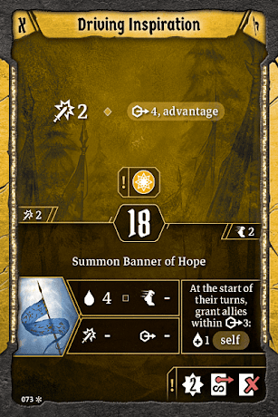
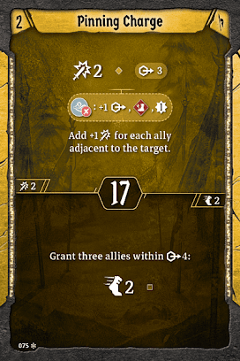
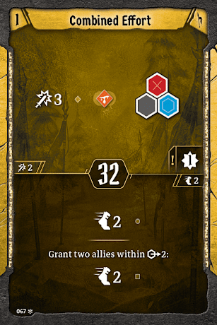
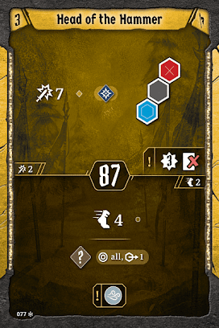
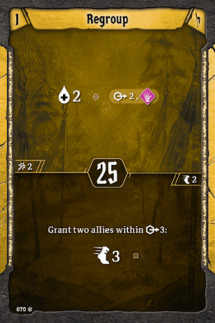

# Level 4 Hand

[Level 4 Level\-up Choice](#level-04)

Banner

Attacks

Movement

Utility

Air Support knocks Incendiary throw out; it’s a much better option for shielded enemies, and it makes an element we care more about. We’ll get another use for wind in a few levels; for now, it just means we’ll be able to use [Pinning Shot](#level-02) at the best moment without having to plan perfectly, since we’ll have wind a few times each scenario. With that in mind, don’t be afraid to use Trained Falcon on occasion. Not only does it deal great damage and provide some much needed XP, but it’ll also empower [Pinning Shot](#level-02) for us.
