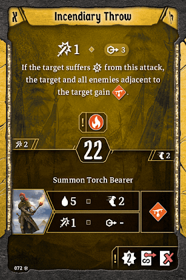

# Level 6 Hand

Banner

Attacks

Movement

Utility

Bolstering Shout is a clean upgrade to [Regroup](#_f2fhrv8ka4t7). We probably don’t want both, especially since we’ve got more than enough wind to reliably activate Bolstering Shout at full potential. 

[Level 7 Level\-up Choice](#_evryw5h9qipk)
