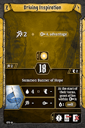
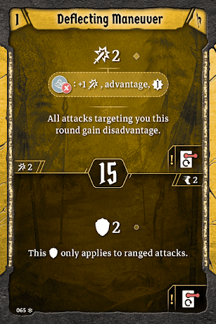
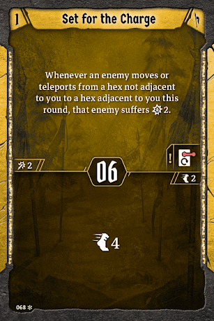
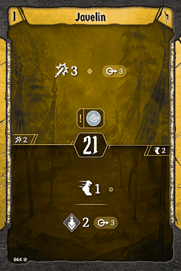

# Level 7 Hand

Banner

Attacks

Movement

Utility

Lead From Afar is the perfect attack for us \- if it’s genuinely very crowded, this should regularly be an attack six, seven with the banner. We’ll cut Incendiary Throw to make space for the fourth ranged attack here. If the frontline is so crowded that you’re having trouble making the [Falcon](#_73xk82jjscx8) work, consider summoning the Longbowman. It’ll do an insane amount of damage when paired with your banner, it’ll stay out of the way, and you won’t have to worry about using bottom actions to summon or move your summon around. Of course, if it is that crowded then the top of Lead from Afar will do an absurd amount of damage anyway. I’d make the choice based on shield: if there is a lot of shield, then the top massive attack is more important than the bottom. Use both this and [Air Support](#_73xk82jjscx8) to wail on the monsters with massive heavy hits. Conversely, if there is low shield, Longbowman will do much more damage over time with infrequent attacks for three. [Air Support](#_73xk82jjscx8) is still fine as an attack four that makes wind, even if the pierce is irrelevant. 

[Level 8 Level\-up Choice](#_8efd26767tlw)
