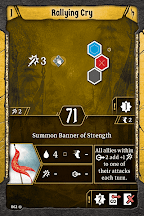
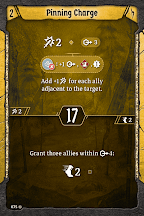
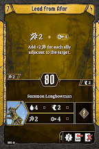
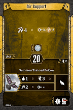
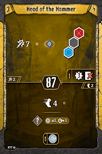
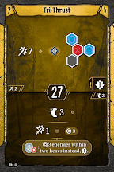
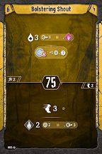

# Level 8 Hand

Banner

Attacks

Movement

Utility

Tri\-Thrust gives us one final outlet for our wind, letting us deal damage with bottom attacks. We need to drop an attack, so we’ll let [Driving Inspiration](#_yc7xrq7k6p0v) go; it’s our lowest damage value, and it makes an element we don’t really care about. That being said, we still want to use this banner when conditions are rampant, so we can cut Javelin instead at those times. This allows us to move Air Support back to being primarily a top action. This is really our biggest power spike in the game; we have four phenomenal ranged attacks, a banner that boosts them all, three excellent outlets for wind (which will keep our XP rolling), and enough to do on bottom that we never feel like we’re standing still. 

[Level 9 Level\-up Choice](#_qga2kckizsc5)
