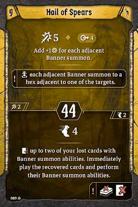

# Level 9 Hand

[Level 9 Level\-up Choice](#level-09)

Banner

Attacks

Movement

Utility

Hail of Spears not only provides damage but also banner movement. For this reason, we’ll be cutting out [Combined Effort](#combined-effort). We should be able to move banners in with Hail of Spears, then move them to safety with [Boldening Blow](#level-04) or [Pinning Charge](#level-02). We do want to have the option for a second banner, both to make the top action of Hail of Spears stronger as well as to validate using the bottom for full potential. For this reason, we’ll bring back [Driving Inspiration](#driving-inspiration) if we dropped it last level, relocating [Air Support](#level-04) back to utility, and cut [Javelin](#javelin). This does reduce the amount of wind we’ll be making on rounds where we use [Air Support](#level-04) as a falcon, but since we don’t care about XP anymore that’s usually ok. We can either drop both banners early and plan to have two to throw right from the beginning, or we can lose [Driving Inspriation](#driving-inspiration) on our first long rest and pull it back if/when we lose the banner on [Rallying Cry](#rallying-cry).
