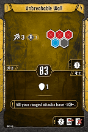
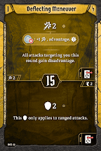
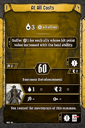
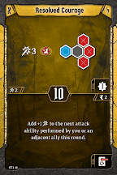
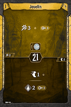
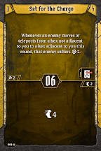
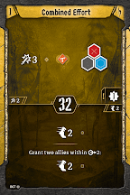
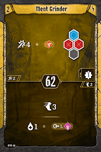
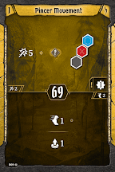
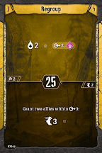

# Level 2 Hand

Tankiness

Attacks

Movement

Utility

We don’t really need that much dedicated movement, so the three we gain from Meat Grinder lets us drop [Tip of the Spear](#_9biaxul0blo7). We should still consider bringing this if there are lots of shielded enemies and our team struggles with them, as this is one of the formations we will be able to reliably activate, or if the scenario looks to be long enough that the extra movement will be important. If either is the case, you can drop [Combined Effort](#_bj30gaanrifd) for now, and grab it again next level. 

[Level 3 Level\-up Choice](#_ltgmq3nx49ls)
