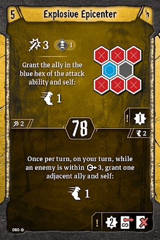

# Level 5 Hand

Tankiness

Attacks

Movement

Utility

We’ll drop [Pincer Movement](#_768ksnsz0b8i) most of the time, although we can bring it back for easy scenarios. We should be able to move onto coins frequently enough as we don’t really need to position ourself very precisely, so we’ll still be looting a decent bit while still allowing our banner to keep pace. 

[Level 6 Level\-up Choice](#_fr2ygoeo0hfq)
