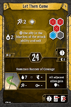
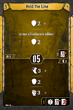
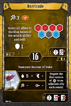

# Level 6 Hand

Tankiness

Attacks

Movement

Utility

Barricade pushes out [Deflecting Maneuver](#_hu136o2o5ou) as a quick attack that increases our survivability for a round. I would bring back [Deflecting Maneuver](#_hu136o2o5ou) for the bottom in scenarios that have an extreme number of ranged\-only enemies, and I would drop [Regroup](#_f2fhrv8ka4t7) to make room. If you are in a two player party, or else the scenario has a large number of heavy hitters rather than a swarm of weaklings, consider setting up the banner on Barricade. In this instance, we’ll use [Let them Come](#_ltgmq3nx49ls) as a formation attack, since we can’t really afford three losses, and again give up [Regroup](#_f2fhrv8ka4t7). 

[Level 7 Level\-up Choice](#_evryw5h9qipk)
