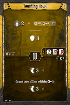

# Level 8 Hand

Tankiness

Attacks

Movement

Utility

We can finally drop [Combined Effort](#_bj30gaanrifd) now that we have another strong movement option for our banner(s). Try not to use the loss on Taunting Howl until the final room, or you might not be able to have your banners keep up. If the scenario looks like it has an absurd amount of distance to traverse, you will want to bring back [Combined Effort](#_bj30gaanrifd) so that you have more than enough movement to get your banner(s) where they need to be. If you took Sweeping Aid here instead, you can’t afford to drop [Combined Effort](#_bj30gaanrifd). Consider dropping [Set for the Charge](#_fheghtjp3um9) instead, or [Javelin](#_yjv3bbxgjo2l) if you’ve enhanced something with wind. 

[Level 9 Level\-up Choice](#_qga2kckizsc5)
