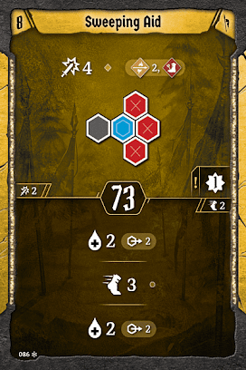
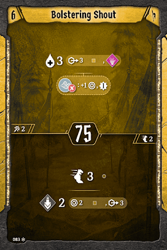

# Level 9 Hand

[Level 9 Level\-up Choice](#level-09)

Tankiness

Attacks

Movement

Utility

Sweeping Aid’s bottom action will do a lot for us. It’s almost as much movement as [Set for the Charge](#set-for-the-charge), so we’ll make the upgrade. Remember: if you’ve enhanced something with wind, [Javelin](#javelin) is our weakest action, so we’ll want to cut that instead so we can keep another awesome initiative around.
