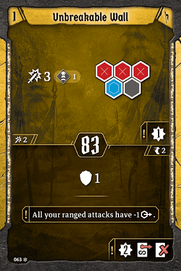
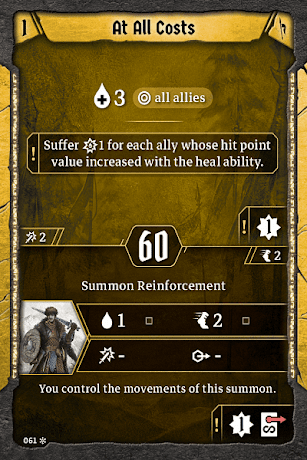
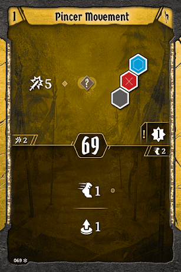

# Opener

We’ll start by listing out an example of what your first three turns might look like when starting a scenario. The action outlined is the one we’ll use for initiative. 

|  | Turn One | Turn Two | Turn Three |
| --- | --- | --- | --- |
| Top Action |  |  |  |
| Bottom Action |  |  |  |

As we’re tanking for our team, our goal is typically to go fast all the time. We open by activating our shield and preparing for the enemy advance. The following turn, we create wind and set up a Reinforcement to take a big hit at some point. Don’t be afraid to hold the [Reinforcement](#at-all-costs) back if it looks like it’ll be more useful on a future turn. The following round, we’ll be able to hit again and force disadvantage on our foes. We can loot if something has died; if not, consider granting additional movement to your allies instead.
