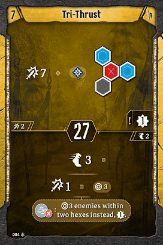
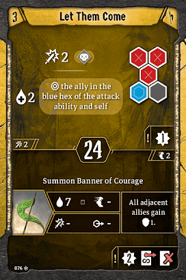
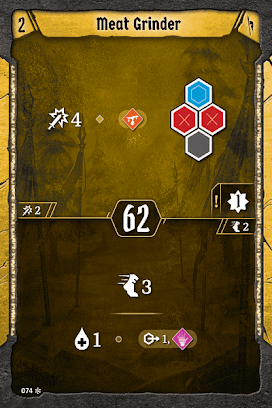
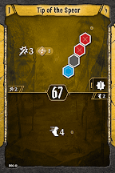
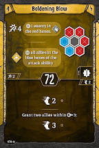
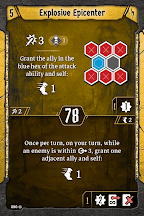

# Level 5 Hand

Formations

Movement

Utility

Explosive Epicenter provides an awesome formation and an awesome loss for us. I would try the loss for at least one or two scenarios and see how much value you get for you and your party. I think most parties will be very happy to have it, and those that aren’t will find that the top action provides immense value. Either way, the loss on [Unbreakable Wall](#_u2k00e745ao6) is somewhat outdated. We would like to avoid running both losses, and the shield is a bit weak now that enemies will be hitting much harder. If you are running in a very large party, or there are lots of enemies with retaliate within a scenario, consider bringing [Unbreakable Wall](#_u2k00e745ao6) over [Rallying Cry](#_oncl1tu76ylp), as disarming one enemy is less impressive than shoving three. 

Your opening plays haven’t changed much, but we will play Explosive Epicenter’s loss on our first round if we are running it. If we aren’t, I would plan to move slowly and run a formation after the enemies have acted. Something like [Let Them Come](#_ltgmq3nx49ls) is usually easy to set up and will reliably hit 2\-3 enemies when combined with granted movement or a summon. 

[Level 6 Level\-up Choice](#_fr2ygoeo0hfq)
