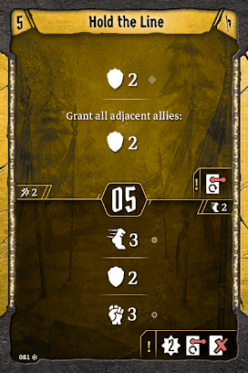

# Level 6 Hand

Formations

Movement

Utility

We don’t really need this many formations, so we’ll drop [Rallying Cry](#_oncl1tu76ylp). Disarm is still good, but the bottom action is our least flexible, we aren’t short on late\-ish initiatives, and Barricade provides an incredibly valuable action. If you are in a two player party, you can probably set this up with your ally plus a summon, but it will be tough. If you think that isn’t realistic, then we can take Bolstering Shout instead and replace [Regroup](#_f2fhrv8ka4t7). 

[Level 7 Level\-up Choice](#_evryw5h9qipk)
