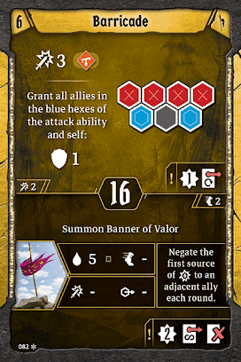
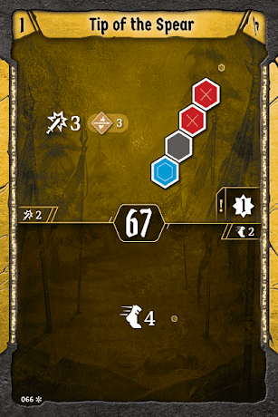
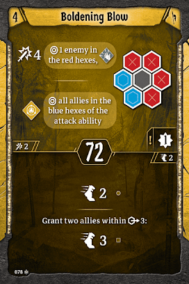
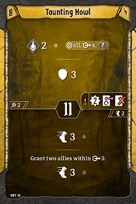

# Level 8 Hand

[Level 8 Level\-up Choice](#level-08)

Formations

Movement

Utility

We had two amazing choices for what to pick here. I think most [Tacticians](#tactician/summary) should bring Taunting Howl, which slots in nicely with [Boldening Blow](#level-04) to enable all of our ambitious formations. In some parties, picking Sweeping Aid is a fine choice, bumping [Meat Grinder](#level-02) down to the movement category and giving us four spectacular formations to work with. Either way, we now have enough bottom healing that we shouldn’t really need [Regroup](#regroup). I would bring [Regroup](#regroup) in scenarios with lots of movement between rooms as something to do on top in your downtime, but in very combat\-heavy scenarios it’ll be a dead card more often than not. Also, remember that we are keeping [Pincer Movement](#pincer-movement) around just as a loot at this point. If the scenario is too challenging to justify this, drop that instead.
