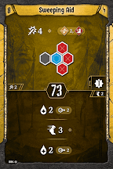
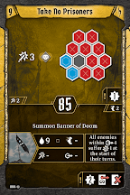

# Level 9 Hand

Formations

Movement

Utility

The ultimate formation bumps [Pincer Movement](#_768ksnsz0b8i) out of our hand. If we do still want to aggressively loot, swap it in for either of our move fours; we have enough decent move 3 actions that we can get away with it if the scenario isn’t too punishing. Otherwise, we have eight fantastic formation options overlapping with six fantastic movement options. We should find something decent to do every single turn, while keeping the enemies more or less permanently wounded and poisoned.
