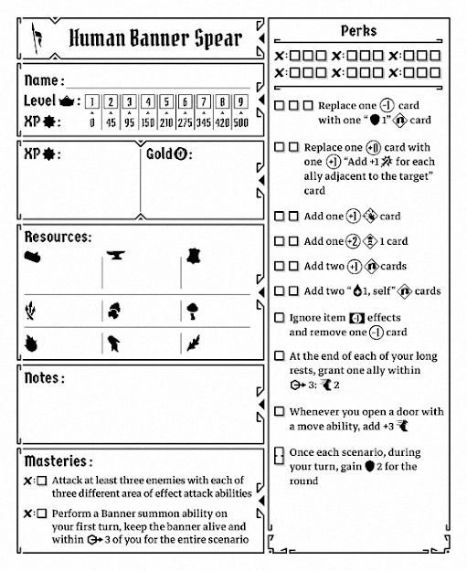

# Perks

- [ ] <!-- check:ignore-item-effects --> We will want some armor to survive the turns we invade enemy territory, so we begin by ignoring negative item effects. Removing the (\-1) is a spectacular bonus.
- [ ] <!-- check:rolling-shields --> Replacing our (\-1)s with rolling shield modifiers will improve both our AMD consistency and our tankiness.
- [ ] <!-- check:two-shield --> Even though our main priority isn’t tanking, having a panic button gifting us two shield for a turn if the enemies have a bad draw will play around our lose condition quite nicely. You shouldn’t rush this perk, but if you ever gain two marks at once, I would pick this one up.
- [ ] <!-- check:door-movement --> The extra movement when opening a door is good \- but not to run in, to run out. Try to run ahead of your party whenever possible, open a door, then use the movement from this to run backwards. The enemies will rush at you through the doorway, allowing you to take them on a few at a time. Just don’t attempt this if there are enemies that summon, as you these are enemies you don’t want to leave alone for too long.
- [ ] <!-- check:remaining-amd --> The rest of the perks don’t do anything that synnergizes particularly well with this build, but they do still improve your deck in marginal ways. The choices here depend on what your party can do \- compensate for what it can’t with additional CC, healing, or simply raw damage. The push modifiers aren’t valuable for the push, but they’re still \+2 cards. In the absence of necessity, I prefer adding the rolling damage first, then the disarms, then the heals, and then the pushes. Also, grab the shield perk if you haven’t taken it by now.
- [ ] <!-- check:rest-movement --> The granted movement seems like it’d be good, but it’s unlikely that a small granted move after your rest is the make\-or\-break for most formations. This perk is better for dragging a banner, which we won’t be doing. Still, it’s strictly positive value, so we’ll pick it up.
- [ ] <!-- check:replace-zeros --> Replacing our 0s with 1s that will usually just be 1s is extremely marginal but still worthwhile. We’ll line this up last.
