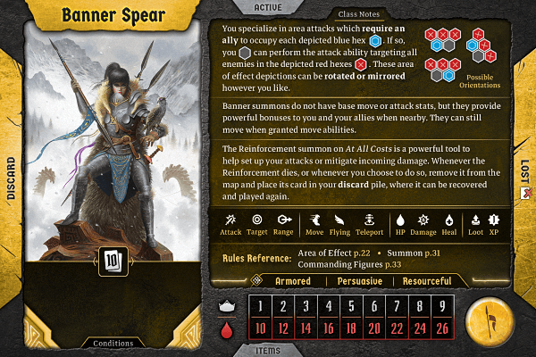

This guide will be much cleaner to read if you disable print layout (in the “view” menu). 

Characters in Frosthaven don’t have a fixed gender, so that you can roleplay your character as the gender of your choosing. I played my first Bannerspear as a woman, so I’ll be using she/her pronouns. Feel free to choose a different gender for your Bannerspear!   

The Bannerspear is a low complexity, high health starter class for Frosthaven. They have numerous ways to gain shield and heal themself, becoming incredibly tanky. They have more ranged attacks than you would typically expect from these types of tanky characters, and a few summons they can use to great effect. The Bannerspear’s two most unique aspects are their formations and their banners. Formations allow the Bannerspear to perform powerful (often AOE) attacks, but only if they can get one or more allies into the right position. These formations tend to be much more devastating than similar attacks at similar levels, although they do require the bannerspear to put themself in much greater danger. Meanwhile, banners are summons that do not move or attack, but instead provide a passive benefit for all allies within a certain range. The fact that these summons do not move means you will have to spend quite a bit of time granting them movement, but the benefits are *well* worth it. 

Each formation describes an AOE hex pattern including a space where you need to stand and one or two spaces where allies need to stand. You can only perform these abilities if each blue hex is occupied by one of your allies. While each blue hex does need to be occupied, you don’t have to fill every red hex; like with standard AOE attacks, you simply need to have at least one valid target. Most patterns only have one spot for an ally. As a general rule, the more complicated or dangerous a pattern, the more valuable the reward. Many of these patterns add damaging or disabling conditions in a sizable AOE, allowing you to poison, immobilize, push, or otherwise disrupt many enemies at once. Some of these patterns necessitate one of the characters involved to be in grave danger for a typical fight, so you will need to carefully time these patterns around your enemies to minimize the cost. 

Your banners are lost summons created by the bottom half of an ability card. These banners provide a powerful bonus, such as additional damage or healing, to allies within a certain range. It is worth stating explicitly that, since you are an ally to your banner, you yourself benefit from these boons in addition to your allies. The catch is that not only do these banners not attack, but they also do not move on their own. They can still be pushed, pulled, and granted movement, which means you can put a lot of work moving them with the party, but it will take a lot of work at lower levels. You will also have to protect them well, as these banners have health and can be attacked and damaged like any other summon, and you do not have the means to recover them if they die. 

Bannerspear is one of the most flexible starter classes, second only to the Drifter in how many different options are available to them. I view the Bannerspear as having four main strengths for you to build around: formations; banners; tanking; and ranged support. If you would like to build your own Bannerspear, my recommendation is to choose one of these facets as your primary focus, and one as your secondary focus. Any combination of two should work reasonably well. That’s not to say that a tanky formation bannerspear can’t heal or use banners; but if you try to do everything, you’ll excel at nothing. Rather than presenting every combination, I’ll be focusing on three that highlight some of the Bannerspear’s options that I think synnergize particularly well together. 

The first build, which we’ll call [Tactician](#tactician/summary), focuses on formations as their primary aspect and tanking as a secondary aspect. The Tactician forgoes banners completely in order to remain mobile enough to guarantee a formation attack most every turn. Since they will need to invade enemy territory with relative frequency, they’ll make themself tanky enough that they can afford to take a stray hit here and there. 

The second build, which we’ll call [Stonewall](#stonewall/summary), focuses on tankiness as their primary aspect and banners as a secondary aspect. The Stonewall provides some damage on their own, but for the most part assists their team by absorbing enemy damage, lugging around banners for support, and overall ensuring that the rest of their team can be as efficient as possible with their own actions. 

The third build, which we’ll call [Breezing Banner](#breezing-banner/summary), focuses on banners as their primary aspect and ranged support as a secondary aspect. The name derives from the fact that this is the only build for which we will prioritize infusing and consuming wind ourself.
