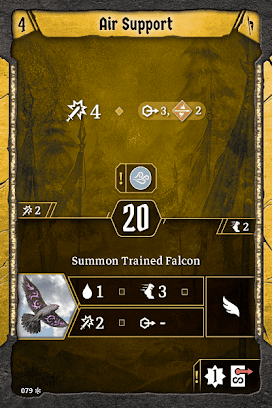

# Level 4

Air Support offers a simple yet powerful ranged attack. Strong damage, excellent pierce, solid range, decently quick initiative, and an element we might want. There’s not much to say about this card, it’s reliably very good. It’s not going to generate a story you’re going to reminisce about, but it should never fail to find value. 

The Falcon is pretty sweet. It’s much like the [Reinforcement](#_b47um9ulhbgb): drop it where you need it for a formation, then expect it to tank a hit somewhere down the road. It’s nonloss, so we are ok to spend even that’s all it does, but if we’re lucky it’ll stick around for a bit and provide some value. It does have a drawback in that you can’t control its movement, so it might tank a weaker hit than you’d like, and it will be more difficult to line it up for formations after the first. However, it does have two huge benefits that make it impressive as a level four card. First of all, it has three movement instead of two, and it has flying. We’ll usually have to grant it movement to get value out of this, but we can *much* more easily line up pincer movement and similar formations now that we have an expendable ally that can easily reach the backlines. Oh, and this one attacks. Two damage isn’t amazing, but if we had a bottom action that said “attack two, range four, disarm”, we’d take it in a *heartbeat*. This is that, plus it might hit more and it enables some formations. It’s hard to be disappointed by this card. Just as with the [Reinforcement](#_b47um9ulhbgb), make sure you remember to discard it for stamina when relevant. 

“There’s *no way* this is a level four card.” Ok, now read the card again, and we can discuss it properly. Boldening Blow is *not* an attack 4, disarm on four targets. That would probably not fly as a level nine, even at this slow\-ish initiative. Boldening Blow is an attack 4, disarm on one adjacent target within the red hexes. The attack is not AOE at all, it’s just written as such because thats how formations look, and you need some allies lined up to validate it. Attack 4 disarm is a fine level 4 action, but it’s fairly underwhelming when it comes with a positional requirement. However, if you consider that we also get to bless both allies, the action comes back up to our expectations. Similar to the heal on [Let Them Come](#_ltgmq3nx49ls), promising your allies a bless makes them *much* more likely to take the time and risk setting up a formation for you. The bless is of course of variable value (Deathwalker will love a bless for their frequent attack fives, whereas boneshaper is underwhelmed for their attack twos). Still, it’s rarely negative value, so this action is fairly strong. 

The bottom action provides some fantastic granted movement. It’s the same as [Combined Effort](#_bj30gaanrifd), except that the range is higher for the grant. This is much more significant than it seems; a range of only two is challenging to line up, but three will rarely whiff. We can use this to fulful lots of formation dreams that weren’t really viable before. Plus, by bringing both “move self and allies” cards, we can now realistically bring one or two banners with us for the entire scenario. 

[Tactician](#_916yt4oqmln1): Boldening Blow is usually the choice here. We’re going to lean more on the bottom than the top, allowing us to easily reposition ourselves and our allies to consistently line up formations. However, I would consider taking Trained Falcon in a two player party. You’re going to want two allies for either half of Boldening Blow \- especially the top half \- so if you only have one ally, this card loses some luster. Having another ally that you can generate when needed will enable lots of formations. If you do this, it’s probably best to come back at level six and take Boldening Blow anyway. 

[Stonewall](#_ydaqocq9xs69): We need the bottom of Boldening Blow in order to keep our banner in range. 

[Breezing Banner](#_rggu3f79bw1o): Air Support is one of the best cards we’ve seen so far. We’re going to rely heavily on both halves moving forward.
