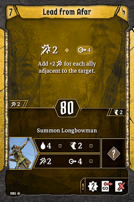

# Level 7

The top action from Lead from Afar is much the same as that from [Pinning Charge](#level-02), except that it scales better with the number of allies. This will probably be an attack 6\-8 most of the time if you have a crowded party, and in theory could be an attack 14 but only if you spend every bit of luck for the next seven years. All of the discussion from that card (except the immobilize) holds: in a two player party, you don’t want this. In a large party with a swarm of summons, you absolutely do. 

The Longbowman is really strong even though it doesn’t really do anything that has anything to do with the rest of your builds. It doesn’t line up that nicely for formations, it doesn’t tank, it doesn’t provide passive bonuses. It just stands back and hits. It has great range and enough movement that we should expect it to find a target every single turn that there are enemies. The muddle is nice but not the main point. Very simply, if you aren’t running a loss at this stage you should strongly consider the Longbowman because it will provide an absurd amount of effort if you just set it up and then forget it exists. Because of the long range, you shouldn’t even need to do much to protect it. Even multitargeters will probably not reach the summon in most cases. It just lives and hits, and that’s all we want. 

Tri\-Thrust looks a bit familiar. Seven damage and stun was presented at [level three](#level-03) as a loss action; we get it here as nonloss. Now, this formation is *difficult*. You need to have three specific spots open around an enemy, at least one of which is probably dangerous. The easiest way I have usually found for this one is to have two allies split in front around an enemy and to jump myself into the backline. The effect is obviously fantastic, it’s a ton of damage and hard disable at half decent initiative. It’s difficult to adjust this stun to the most valuable target due to the positioning requirements, so just plan to stun something that is nearly always a threat and hope that you were right for the turn in question. Even if you aren’t, it’s still a lot of single target damage, something that’s rare in formations.  

We haven’t really seen any bottom attacks on the Bannerspear. This doesn’t hit very hard, but it hits a lot of enemies. You can usually make this work decently well without the wind, but with it you’ll often go from two targets to three. Plus, with the extra range you can avoid retaliate and pick your targets more carefully. It doesn’t hit very hard, but at this point we’re level seven. Our AMD is good enough that we’ll get a few damage on each target and likely trigger some conditions. It’s not a high impact action but it provides something we couldn’t do before and for that, we are grateful. 

[Tactician](#tactician/summary): We’ll pick up Tri\-Thrust. We’re always on the lookout for good opportunities to use the top, but most of the time we’re simply happy to use the bottom, as our positioning requirements mean we’re frequently going to be in the think of things. 

[Stonewall](#stonewall/summary): If we weren’t already running multiple persistent losses, we’d definitely consider the Longbowman. As is, we really can’t afford it. As a result, we’re going back here for whichever level six card we skipped last time around. 

[Breezing Banner](#breezing-banner/summary): Lead From Afar is the best thing we’ve seen since Air Support. Even though we’re skipping a wind consumption, the strong attack paired with the excellent summon make this an easy choice for us.
